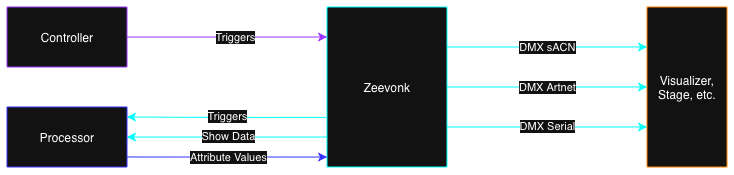

# Zeevonk

A modular lighting control system for modern DMX-based lighting setups.

> ⚠️ **Warning**
>
> Zeevonk is currently in early development. APIs, features, and behavior may change frequently and without notice.
> It is **not yet recommended for production use**.

## What is Zeevonk?

Zeevonk is a modular system for controlling lighting fixtures. It consists of a server and two types of clients:

- **Server**: Manages clients, processes triggers and attribute updates, and sends DMX data.
- **Processor Client**: Calculates and sends fixture attribute values (like color, position, intensity) to the server.
- **Controller Client**: Sends triggers (such as button presses or fader moves) to the server.



This project is the result of a deep rabbithole I went into, when creating [Radiant](https://github.com/BaukeWestendorp/radiant). I realized I was writing the same DMX resolvers for GDTF files over and over again. Zeevonk is my way of consolidating all of my research into a hub for DMX lighting.

## Some notable controllers:
- [**zv-ctrl-bmdse**](https://github.com/BaukeWestendorp/zv-ctrl-bmdse): A Black Magic Design Speed Editor controller client based on [bmdse](https://crates.io/crates/bmdse).

## Run the Zeevonk server

You can install zeevonk as a binary (called `zv`) using the following command:

```sh
cargo install --path crates/cli
```

## Use as a library

### Features

The crate has three main features you can enable:

`server`: Start and configure the server from your own code instead of the CLI.

`client-processor`: Use the processor client.

`client-controller`: Use the controller client.

### Example: Starting the Server

```rust
use zeevonk::server::Server;
use zeevonk::project::file::ProjectFile;

// Create a project file.
let project_file = ProjectFile::default();

// Create and start the server.
let server = Server::new(project_file).unwrap();
server.start();
```

### Example: Processor Client

```rust
use zeevonk::attr::Attribute;
use zeevonk::client::processor::Client;
use zeevonk::ident::Identifier;
use zeevonk::project::stage::{FixtureId, FixtureIdPart};
use zeevonk::value::AttributeValues;

#[tokio::main]
async fn main() {
    let mut client = Client::new(Identifier::new("zv-example-processor").unwrap());
    client.on_trigger(|from_client, trigger| eprintln!("{from_client}: {trigger:?}"));
    client.connect("ws://127.0.0.1:7334").await.unwrap();

    let fid = FixtureId::new(FixtureIdPart::new(101).unwrap());

    let mut values = AttributeValues::new();
    
    // Set attribute values for your fixtures here...
    values.set(fid, Attribute::Dimmer, 1.0);
    
    client.update_attributes(values, false).await.unwrap();

    loop {}
}

```

### Example: Controller Client

```rust
use zeevonk::client::controller::Client;
use zeevonk::ident::Identifier;
use zeevonk::trigger::{Trigger, TriggerValue};

#[tokio::main]
async fn main() {
    pretty_env_logger::init();

    let mut client = Client::new(Identifier::new("zv-example-controller").unwrap());
    client.connect("ws://127.0.0.1:7335").await.unwrap();

    loop {
        client
            .send_trigger(Trigger::new(
                Identifier::new("button-1").unwrap(),
                TriggerValue::Boolean(true),
            ))
            .await
            .unwrap();

        std::thread::sleep(std::time::Duration::from_secs_f32(1.0 / 10.0));
    }
}
```

For more details, see the documentation for each module in the crate.

## Licensing

This project is dual-licensed under:

- MIT License
- Apache License, Version 2.0

You may choose either license to govern your use of this project.
See the LICENSE-MIT and LICENSE-APACHE files for details.
